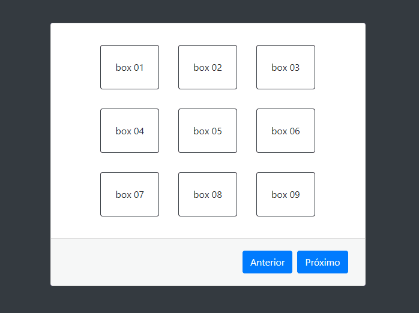
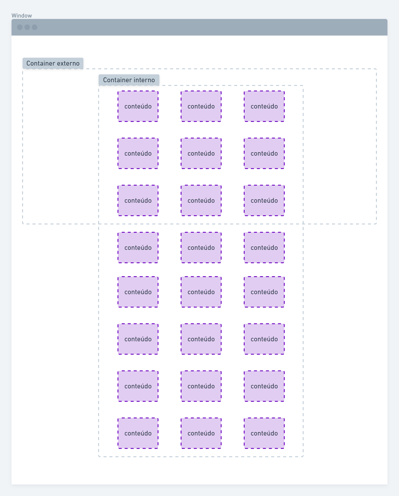

## Paginação de conteúdo

Este código javascript serve para dividir os itens de um bloco de elementos html em seções para depois adicionar navegação entre essas seções.

No exemplo acima temos 24 caixas de dimensões iguais que foram divididas em grupos de 9, logo resultou em 3 seções para navegar.

## Estrutura

Primeiramente devemos entender a estrutura básica para construir o html. São 3 elementos básicos: container externo que funcionará como uma janela fixa, um container interno que será a nossa página rolável, e por fim o conteúdo composto por vários itens de tamanhos semelhantes.

## Como usar

Entendido a estrutura do html basta seguir a seguinte configuração:

#### Container externo
- Adicionar a classe `sections`;
- Os atributos `data-id` com o nome único para identificação e
-  `data-items-section` com a quantidade de itens que deve ser agrupado por seção.

Isso já basta para o script realizar o dimensionamento dos elementos, mas precisamos identificar os botões para as ações de navegação entre as seções.

#### Botões
- Teremos dois botões, em cada um deles deve ser adicionado o atributo `data-handle-section` com o nome definido em *data-id* da seção que deseja interagir. 
- Para o botão de PRÓXIMO deve ser adicionado o atributo `data-type` com o valor `next`.
- Para o botão de ANTERIOR deve ser adicionado o atributo `data-type` com o valor `previous`.

